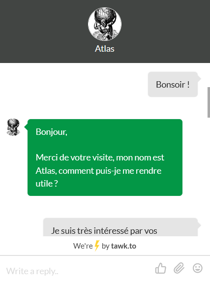

# Nhaugstyng
## Challenge Réaliste (Web Client – SE) 
#### Octet Mignonne & Medus'Hack
### Perchax - ZaiiMx - iHuggsy -  Atlas

## Enoncé
Un hébergeur peu scrupuleux fournit ses services à un réseau de pédophiles. Ils sont intouchables et le service client ne veut rien entendre.
La gendarmerie vous a engagé, trouvez un moyen de supprimer leur serveur dont l'IP est: 74.51.217.27 (IP aléatoire, HORS SCOPE DU CTF, A NE PAS ATTAQUER).
Pour cela trouvez une vulnérabilité sur le site !

PS: Le support en ligne est constitué de personnes réelles.

---

[HINT NUMERO 1](https://slides.com/atlas453/deck-aaf3a1/#/pres)

---

Nombre de points: 500

Flag: MCTF{S3LF_X$$_1NT0_S3_1N70_C$RF_HaHaHa!!}

## Write Up

### Etat des lieux
On se rend sur le site de ce fameux hébergeur. 
Le site est en somme classique, on peut tout de suite identifier une barre de navigation en haut à droite et 3 menus.

On peut également voir un support en ligne qui semble disponible pour discuter, une fenêtre de discussion s’ouvre en cliquant sur We are Here :

On sait que le service client ne veut rien entendre, il est donc inutile de leur demander gentiment de supprimer le serveur. On pourrait cependant tenter du SE en dernier recours.

L’utilisation d’outils automatisés est interdite, nous n’utiliserons donc pas de fuzzing pour lister les fichiers à notre disposition, cela ne semble pas être la visée du challenge.
On se déplace tout d’abord dans l’arborescence du site, il ne semble pas y avoir de vulnérabilité côté serveur, la version Apache est à jour, la distribution également. Il n’y a pas non plus d’action possible sur le site hormis la réservation de domaine.

### La Self XSS
Sur la réservation des noms de domaine, on essaye tout d’abord de modifier les paramètres du formulaire POST en passant en tableau pour le paramètre domain, ce qui pourrait créer un warning ou une erreur.

On peut voir que le contenu de notre paramètre POST est directement affiché dans value="", on peut supposer qu’il y a une vulnérabilité XSS si le contenu est affiché directement.
Ainsi nous sortons de la valeur pour insérer un script et nous obtenons une XSS en POST.

Nous ajoutons hidden pour qu’il n’y ait pas de trace visible de notre injection, et nous recréons un input d’apparence rempli.

Résultat:

Nous avons une XSS exploitable en POST, qui n’est pas stockée, on peut ainsi la qualifier de « self-xss », dans le sens où il est difficilement imaginable de l’utiliser pour obtenir des accès administrateurs ou effectuer toute autre action à haut risque pour l’administration.

### SPREAD IT
Cependant, nous avons assisté à la dernière conférence à l’ESN’HACK sur l’exploitation de self-xss, notamment en POST. Les payloads de démonstration sont toujours disponibles, pour le concept de l’exploitation, il s’agit d’attirer un administrateur sur un site malveillant qui enverra une requête POST sur le site cible en exécutant la XSS, de manière transparente.

Cela tombe bien, nous pouvons directement parler avec le support, nous n’avons trouvé aucune autre vulnérabilité, il va falloir les convaincre par n’importe quel moyen de se rendre une ou plusieurs fois sur un site donné pour exploiter notre XSS.

Commençons par préparer l’environnement nous permettant l’exploitation, pour ce faire nous aurons besoin d’un site, plusieurs offres d’hébergement gratuites permettent d’héberger des sites gratuitement en php, on peut notamment citer Hostinger, Alwaysdata… On peut également utiliser son propre ordinateur en tant que serveur web ou un serveur acheté chez un hébergeur. Dans notre cas, nous utiliserons un serveur personnel.

Ensuite, utilisons le PoC de la conférence:

Nous obtenons donc 2 fichiers pour que l’envoi de notre payload soit invisible :

Notre exploit.evil.com:

Notre evil.com:

En observant nos cookies, on remarque que le cookie de session est en HTTPOnly, on ne pourra donc pas l’exfiltrer, alors nous exfiltrerons le contenu de la page pour voir si nous avons une interface d’administration ou une modification des paramètres du compte.

### La première attaque

Premièrement nous voulons voir ce que l’administrateur voit lorsqu’il se trouve sur la page domaine où la XSS s’exécutera.

Notre payload à envoyer pour le moment sera ainsi:

Nous récupérons le contenu de la page avec document.body.innerHTML, nous utilisons escape pour la transmettre via une requête GET vers notre serveur sur l’URL d’une image que nous créeons. A noter qu’il faut également que notre serveur devant recevoir ces données accepte de longues requêtes GET, pour cela nous avons changé notre configuration d’apache pour augmenter la limite de caractères acceptés dans l’URL.

Notre payload est malheureusement écrite dans un attribut value, elle ne peut pas directement contenir de quote. Nous encodons donc nos quotes avec &quot;.
Ainsi nous avons:

### Le SE
Maintenant il faut que la personne du support, probablement connecté en tant qu’administrateur, se rende sur notre site evil.com, pour cela nous allons réduire l’URL avec un URL shortener et nous afficherons à l’administrateur un message d’erreur crédible sur notre evil.com. Ainsi avec un lien comme: shortened.com/XksOpA4d, l’administrateur sera redirigé sur notre serveur, puis l’exécution de la payload se fera en background et il ne verra qu’un message d’erreur.

Comme scénario, nous allons nous faire passer pour un futur client potentiel, nous lui dirons que nous cherchons un serveur bulletproof et résistant aux ddos, ensuite nous lui dirons que nous avons vu un ancien client mécontent mettre un avis, se vantant d’attaquer le site. Le support pourrait demander plus d’informations par curiosité, ensuite nous lui enverrons le lien.

### Premier résultat

Une fois que l’administrateur s’est rendu sur le lien qu’on lui a envoyé, notre payload est exécutée, nous pouvons constater sur notre serveur sur lequel nous avons exfiltré le contenu de la page que nous avons bien reçu les données. Nous voyons ainsi la page domain.php comme le voit l’administrateur, on remarque notamment la présence d’un lien vers la page d’administration dans la barre de navigation : ./s3cr3t4dm1n.php.

### Deuxième attaque

Notre objectif est maintenant de voir le contenu de cette page, pour cela il suffit de faire une requête XMLHttpRequest, et d’exfiltrer le contenu de la même manière que précédemment en créant une image.
Notre payload devient ainsi:

Comme vu précédemment, nous remplaçons notre ancienne payload par celle-ci et nos encodons les quotes ce qui nous donne :

Nous allons donc faire en sorte de renvoyer encore une fois l’administrateur sur notre payload, cependant cette fois, nous exfiltrerons le contenu de s3cr3t4dm1n.php pour voir ce qu’il est possible d’y faire.

### SE

Pour rediriger encore une fois notre administrateur, c'est très simple, le premier lien lui a montré une erreur Not Found, nous avons juste à faire croire que nous nous sommes trompés.

### Résultat

On voit rapidement qu'il y a un token de protection contre les attaques forgées (token), il existe 4 serveurs, le 3ème est celui que nous ciblons. Pour le supprimer il faut envoyer en POST delete, server avec l'ip du serveur et le token associé à ce serveur.

### Troisième attaque

Nous allons maintenant forger notre requête toujours à l'aide de XMLHttpRequest. Dans un premier temps nous allons récupérer le token.
On peut constater que ce dernier est constitué d'une chaîne de 64 caractères constituée de valeurs hexadécimales.

Nous utilisons ainsi une regex, nous sélectionnons le 3ème token correspondant au serveur cible.

Enfin nous envoyons notre requête POST contenant le token ainsi que l'ip du serveur et nous exfiltrons ce résultat qui devrait contenir le flag.

Comme vu précédemment, nous remplaçons notre ancienne payload par celle-ci et nos encodons les quotes ce qui nous donne:

### SE

Jamais deux sans trois, enfin la dernière étape, il faut faire cliquer l'administrateur une dernière fois sur notre lien.
Pour cela toutes les méthodes sont bonnes, on pourrait recommencer une conversation, utiliser un levier de manipulation différent (argent, contrainte, égo ...).

Nous compterons sur la forte curiosité de ce support pour parler d'un avis différent mais semblable.

### Résultat

Bingo, il a cliqué, nous avons exfiltré le résultat de notre CSRF. Le serveur a été supprimé et nous avons notre flag !

### Plus de réalisme ?

Pour plus de réalisme, nous aurions pu faire une seule payload, nous permettant de nous déplacer en direct sur ce que voit l'administrateur et d'effectuer les actions.  

### Mentions spéciales
- Perchax qui a fait 8 heures de support d'affilées